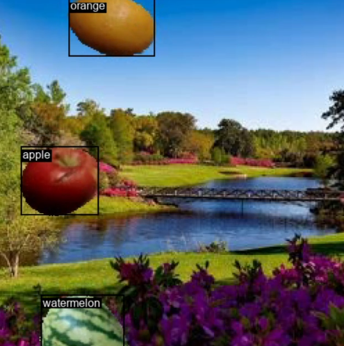

# YOLO Fruit Detection

This repository contains a YOLOv8n implementation from scratch for fruit detection.

Single head, no neck, anchor-free, trained to detect 4 fruits. 
Input image size: 256x256 pixels. 
Output grid size: 16x16 cells. 
Parameter count: 3,482,403 parameters. 
Training steps: 25,000 steps.

## Screenshot

  

## Dataset

Fruit dataset is from:
https://www.kaggle.com/datasets/moltean/fruits

Background dataset is from:
https://www.kaggle.com/competitions/gan-getting-started
